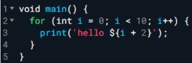
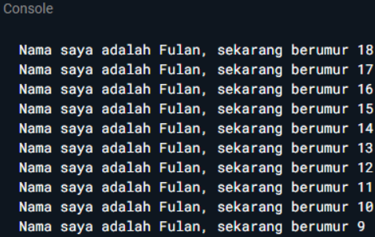
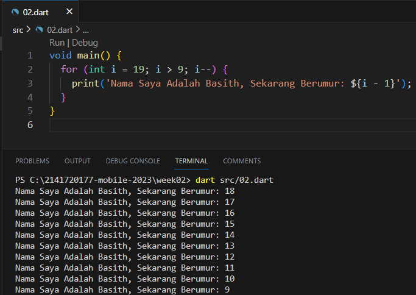

1.  Modifikasilah kode pada baris 3 di VS Code atau Editor Code favorit Anda berikut ini agar mendapatkan keluaran (output) sesuai yang diminta!

    

    Output yang diminta:

    

    <b>Jawab:</b>

    

2.  Mengapa sangat penting untuk memahami bahasa pemrograman Dart sebelum kita menggunakan framework Flutter ? Jelaskan!

    <b>Jawab:</b>

    Memahami bahasa pemrograman Dart sangatlah penting sebelum menggunakan framework Flutter. Dikarenakan Dart merupakan bahasa pemrograman yang digunakan untuk mengembangkan aplikasi dengan basis framework Flutter.

3.  Rangkumlah materi dari codelab ini menjadi poin-poin penting yang dapat Anda gunakan untuk membantu proses pengembangan aplikasi mobile menggunakan framework Flutter.

    <b>Jawab:</b>

    <b>A. Pengertian Dart</b>

        Dart bertujuan untuk menggabungkan kelebihan-kelebihan dari sebagian besar bahasa tingkat tinggi dengan fitur-fitur bahasa pemrograman terkini.
        1. Productive tooling
        2. Garbage collection
        3. Type annotations (opsional)
        4. Statically typed
        5. Portability

    <b>B. Evolusi Dart</b>

        Diluncurkan pada tahun 2011, Dart telah berkembang sejak saat itu. Dart merilis versi stabilnya pada tahun 2013, dengan perubahan besar termasuk dalam rilis Dart 2.0 menjelang akhir 2018

    <b>C. Cara Kerja Dart</b>

        Pengeksekusian Dart dapat dilakukan dengan dua cara yaitu antara lain,
        1. Virtual Machines(VMs)
        2. Javascript Compilations

        Kode Dart dapat dieksekusi pada lingkungan yang mendukung bahasa Dart. Lingkungan yang mendukung bahasa Dart perlu memperhatikan fitur-fitur penting seperti berikut:
        1. Runtime systems
        2. Dart core libraries
        3. Garbage collectors

        Eksekusi kode Dart dapat beroperasi dalam dua mode — kompilasi Just-In-Time (JIT) atau Kompilasi Ahead-Of-Time (AOT).

    <b>D. Struktur Bahasa Dart</b>

        Terdapat 6 struktur dari bahasa dart. antara lain,
        1. Object orientation
        2. Dart operators
        3. Arithmetic operators
        4. Increment and decrement operators
        5. Equality and relational operators
        6. Logical operators

    <b>E. Pengalaman Dart</b>

        1. DartPad
        2. Hello world Dart style
        3. Main function
