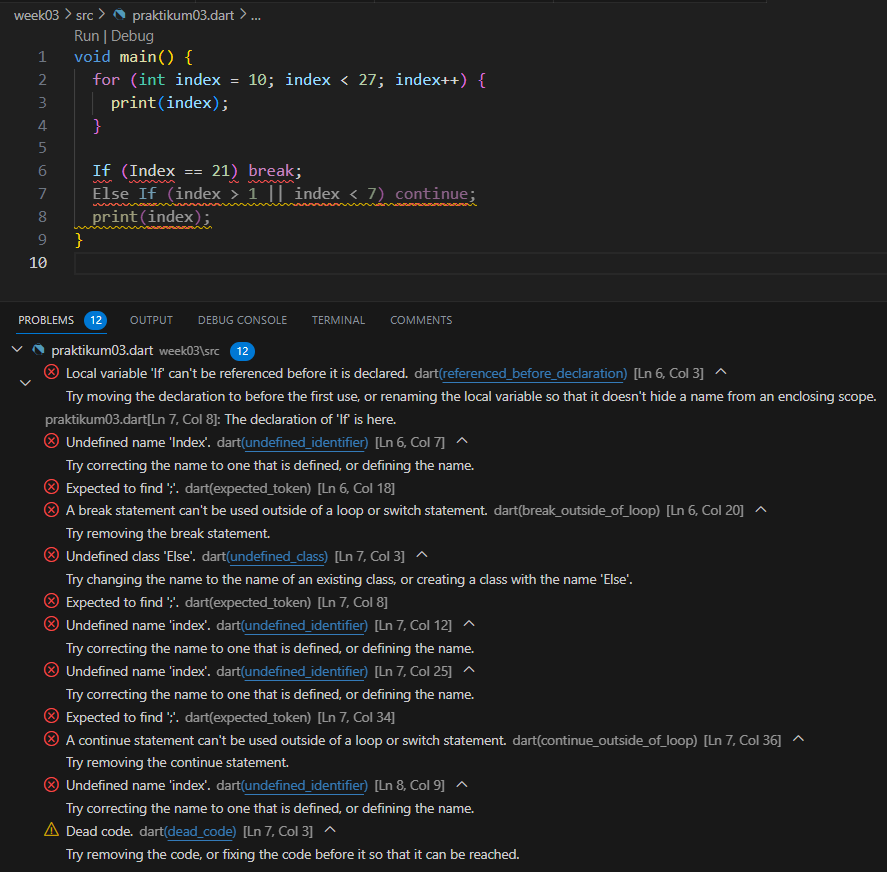

# Praktikum 1: Menerapkan Control Flows ("if/else")

# Langkah 1:

Ketik atau salin kode program berikut ke dalam fungsi main().

# Langkah 2:

Silakan coba eksekusi (Run) kode pada langkah 1 tersebut. Apa yang terjadi? Jelaskan!

<b>Jawab:</b>

    Terdapat banyak kesalahan penulisan kode maupun nama variable pada huruf besar maupun kecil

# Langkah 3:

Tambahkan kode program berikut, lalu coba eksekusi (Run) kode Anda.

Apa yang terjadi ? Jika terjadi error, silakan perbaiki namun tetap menggunakan if/else.

<b>Jawab:</b>

    a. Terjadi error karena pengimplementasian variable kembali dengan nama yang sama.
    b. Untuk menggunakan operasi pembanding untuk simbol sama dengan (=) seharusnya terdapat 2 buah (==).

<b>Perbaikan:</b>

# Praktikum 2: Menerapkan Perulangan "while" dan "do-while"

# Langkah 1:

Ketik atau salin kode program berikut ke dalam fungsi main().

<b>Jawab:</b>

# Langkah 2:

Silakan coba eksekusi (Run) kode pada langkah 1 tersebut. Apa yang terjadi? Jelaskan! Lalu perbaiki jika terjadi error.

<b>Jawab:</b>

Terdapat error karena variable counter belum dideklarasikan

# Langkah 3:

Tambahkan kode program berikut, lalu coba eksekusi (Run) kode Anda.

<b>Jawab:</b>

    Tidak terjadi error. Terdapat penambahan angka mencapai 76 karena terdapat penambahan logika perulangan dengan batas counter < 77

# Praktikum 3: Menerapkan Perulangan "for" dan "break-continue"

# Langkah 1:

Ketik atau salin kode program berikut ke dalam fungsi main().

<b>Jawab:</b>

# Langkah 2:

Silakan coba eksekusi (Run) kode pada langkah 1 tersebut. Apa yang terjadi? Jelaskan! Lalu perbaiki jika terjadi error.

<b>Jawab:</b>

    Terdapat error karena belum adanya pendeklarasian tipe data index lalu terdapat juga kesalahan penamaan variable maupun penentuan perulangan tersebut akan melakukan proses increment ataupun sebaliknya.

<b> Perbaiki:</b>

# Langkah 3:

Tambahkan kode program berikut di dalam for-loop, lalu coba eksekusi (Run) kode Anda.

<b>Jawab:</b>

Apa yang terjadi ? Jika terjadi error, silakan perbaiki namun tetap menggunakan for dan break-continue.

<b>Jawab:</b>

    Terdapat error karena banyak kesalahan sintaks yang terjadi seperti If yang seharunys if dan penamaan variable yang inkonsisten

# TUGAS PRAKTIKUM

Buatlah sebuah program yang dapat menampilkan bilangan prima dari angka 0 sampai 201 menggunakan Dart. Ketika bilangan prima ditemukan, maka tampilkan nama lengkap dan NIM Anda.

<b>Jawab:</b>

