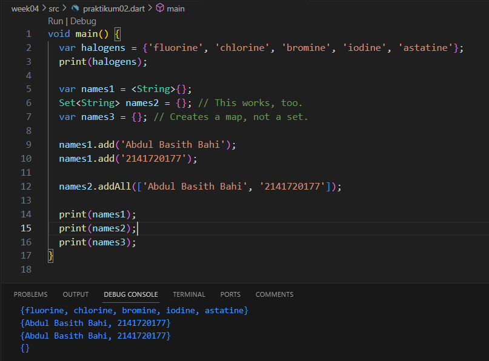
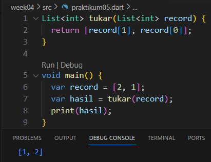
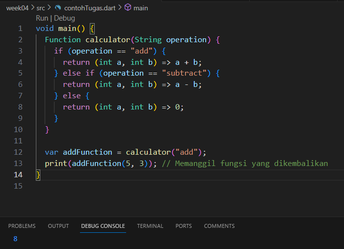
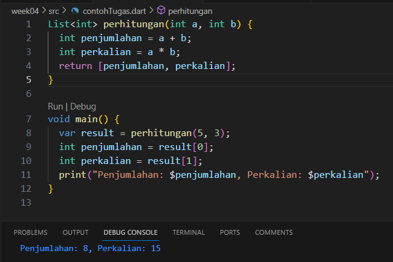

# Praktikum 1: Eksperimen Tipe Data List

Selesaikan langkah-langkah praktikum berikut ini menggunakan VS Code atau Code Editor favorit Anda.

<b>Langkah 1:</b>

Ketik atau salin kode program berikut ke dalam void main().

<b>Jawab:</b>

<b>Langkah 2:</b>

Silakan coba eksekusi (Run) kode pada langkah 1 tersebut. Apa yang terjadi? Jelaskan!

<b>Jawab:</b>

    Terdapat hasil yang terbalik dari pendefinisian awal yaitu 1, 2, 3 menjadi 3, 2, 1. karena menampilkan length = 3, list index ke-1 = 2, lalu penimpaan pada index ke-1 menjadi 1 yang akan memunculkan 1 pada saat proses print terjadi.

<b>Langkah 3:</b>

Ubah kode pada langkah 1 menjadi variabel final yang mempunyai index = 5 dengan default value = null. Isilah nama dan NIM Anda pada elemen index ke-1 dan ke-2. Lalu print dan capture hasilnya.

Apa yang terjadi ? Jika terjadi error, silakan perbaiki.

<b>Jawab:</b>

# Praktikum 2: Eksperimen Tipe Data Set

Selesaikan langkah-langkah praktikum berikut ini menggunakan VS Code atau Code Editor favorit Anda.

<b>Langkah 1:</b>

Ketik atau salin kode program berikut ke dalam fungsi main().

<b>Jawab:</b>

<b>Langkah 2:</b>

Silakan coba eksekusi (Run) kode pada langkah 1 tersebut. Apa yang terjadi? Jelaskan! Lalu perbaiki jika terjadi error.

<b>Jawab:</b>

    Menampilkan isi data dari variable halogens secara keseluruhan

<b>Langkah 3:</b>

Tambahkan kode program berikut, lalu coba eksekusi (Run) kode Anda.

Apa yang terjadi ? Jika terjadi error, silakan perbaiki namun tetap menggunakan ketiga variabel tersebut. Tambahkan elemen nama dan NIM Anda pada kedua variabel Set tersebut dengan dua fungsi berbeda yaitu .add() dan .addAll(). Untuk variabel Map dihapus, nanti kita coba di praktikum selanjutnya.

<b>Jawab:</b>

    Tidak terjadi error dan tetap berjalan dengan menapilkan isi dari ketiga variable tersebut.

# Praktikum 3: Eksperimen Tipe Data Maps

Selesaikan langkah-langkah praktikum berikut ini menggunakan VS Code atau Code Editor favorit Anda.

<b>Langkah 1:</b>

Ketik atau salin kode program berikut ke dalam fungsi main().

<b>Jawab:</b>

<b>Langkah 2:</b>

Silakan coba eksekusi (Run) kode pada langkah 1 tersebut. Apa yang terjadi? Jelaskan! Lalu perbaiki jika terjadi error.

<b>Jawab:</b>

    Tidak terjadi error, dan menampilkan data sesuai dengan variable yang dipanggil.

<b>Langkah 3:</b>

Tambahkan kode program berikut, lalu coba eksekusi (Run) kode Anda.

Apa yang terjadi ? Jika terjadi error, silakan perbaiki.

Tambahkan elemen nama dan NIM Anda pada tiap variabel di atas (gifts, nobleGases, mhs1, dan mhs2). Dokumentasikan hasilnya dan buat laporannya!

<b>Jawab:</b>

    Terdapat perubahan data pada gifts dan nobleGases dikarenakan proses penimpaan data terjadi pada line 19 - 21 dan  24 - 26

# Praktikum 4: Eksperimen Tipe Data List: Spread dan Control-flow Operators

Selesaikan langkah-langkah praktikum berikut ini menggunakan VS Code atau Code Editor favorit Anda.

<b>Langkah 1:</b>

Ketik atau salin kode program berikut ke dalam fungsi main().

<b>Jawab:</b>

<b>Langkah 2:</b>

Silakan coba eksekusi (Run) kode pada langkah 1 tersebut. Apa yang terjadi? Jelaskan! Lalu perbaiki jika terjadi error.

<b>Jawab:</b>

    Terdapat error dikarenakan salahnya nama variable saat proses menampilkan

<b>Langkah 3:</b>

Tambahkan kode program berikut, lalu coba eksekusi (Run) kode Anda.

Apa yang terjadi ? Jika terjadi error, silakan perbaiki.

Tambahkan variabel list berisi NIM Anda menggunakan Spread Operators. Dokumentasikan hasilnya dan buat laporannya!

<b>Jawab:</b>

    Terdapat error karena pendeklarasian tipe data untuk list1 masih belum terpenuhi.

<b>Langkah 4:</b>

Tambahkan kode program berikut, lalu coba eksekusi (Run) kode Anda.

Apa yang terjadi ? Jika terjadi error, silakan perbaiki. Tunjukkan hasilnya jika variabel promoActive ketika true dan false.

<b>Jawab:</b>

    Terdapat error dikarenakan belum dideklarasikannya variable promoActive dan kesalahan sintaks dalam proses perbandingan data.

<b> 1. True </b>

<b>2. False</b>

<b>Langkah 5:</b>

Tambahkan kode program berikut, lalu coba eksekusi (Run) kode Anda.

Apa yang terjadi ? Jika terjadi error, silakan perbaiki. Tunjukkan hasilnya jika variabel login mempunyai kondisi lain.

<b>Jawab:</b>

<b> 1. True </b>

<b> 2. False </b>

<b>Langkah 6:</b>

Tambahkan kode program berikut, lalu coba eksekusi (Run) kode Anda.

Apa yang terjadi ? Jika terjadi error, silakan perbaiki. Jelaskan manfaat Collection For dan dokumentasikan hasilnya.

<b>Jawab:</b>

    Tidak terjadi error, dengan menampilkan keseluruhan isi dari listOfInts dengan tambahan # di depannya.

<b> Manfaat Collection For</b>

    Sederhana: lebih mudah untuk dibaca serta pengimplementasiannya dalam program

# Praktikum 5: Eksperimen Tipe Data Records

Selesaikan langkah-langkah praktikum berikut ini menggunakan VS Code atau Code Editor favorit Anda.

Langkah 1:

Ketik atau salin kode program berikut ke dalam fungsi main().

<b>Jawab:</b>

Langkah 2:

Silakan coba eksekusi (Run) kode pada langkah 1 tersebut. Apa yang terjadi? Jelaskan! Lalu perbaiki jika terjadi error.

<b>Jawab:</b>

Tidak terjadi error dan menampilkan isi dari variable record dengan fungsi record

Langkah 3:

Tambahkan kode program berikut di luar scope void main(), lalu coba eksekusi (Run) kode Anda.

Apa yang terjadi ? Jika terjadi error, silakan perbaiki. Gunakan fungsi tukar() di dalam main() sehingga tampak jelas proses pertukaran value field di dalam Records.

<b>Jawab:</b>

Langkah 4:
Tambahkan kode program berikut di dalam scope void main(), lalu coba eksekusi (Run) kode Anda.

Apa yang terjadi ? Jika terjadi error, silakan perbaiki. Inisialisasi field nama dan NIM Anda pada variabel record mahasiswa di atas. Dokumentasikan hasilnya dan buat laporannya!

<b>Jawab:</b>

    Terjadi error karena mahasiswa adalah tipe non-nullable

<b>Perbaikan:</b>

Langkah 5:
Tambahkan kode program berikut di dalam scope void main(), lalu coba eksekusi (Run) kode Anda.

Apa yang terjadi ? Jika terjadi error, silakan perbaiki. Gantilah salah satu isi record dengan nama dan NIM Anda, lalu dokumentasikan hasilnya dan buat laporannya!

<b>Jawab:</b>

    Tidak terjadi eror dan menampilkan data sesuai apa yang ingin dipanggil.

<b>Penggantian:</b>

# <B> TUGAS PRAKTIKUM </B>

1. Jelaskan yang dimaksud Functions dalam bahasa Dart!

<b>Jawab:</b>

     function adalah sebuah konsep yang mana dapat membuat suatu fungsi sesuai kebutuhan program yang dibuat.

2. Jelaskan jenis-jenis parameter di Functions beserta contoh sintaksnya!

<b>Jawab:</b>

    a. Positional Parameters (Parameter Posisi):

        1. Parameter-posisi adalah parameter yang didefinisikan berdasarkan urutannya dalam daftar parameter fungsi.

        2. Mereka digunakan dengan memberikan nilai secara urut saat memanggil fungsi.

<b> Contoh:</b>

    b. Named Parameters (Parameter Bernama):

        1. Parameter bernama adalah parameter yang diberi nama dan digunakan dengan menyebutkan nama parameternya saat memanggil fungsi.

        2. Mereka memungkinkan Anda untuk memilih parameter yang akan diisi dengan nilai.

<b> Contoh:</b>

    c. Optional Positional Parameters (Parameter Posisi Opsional):

    1. Parameter-posisi opsional adalah parameter yang dapat diabaikan saat memanggil fungsi.

    2. Mereka dideklarasikan dengan tanda kurung siku kotak [].

<b> Contoh:</b>

3. Jelaskan maksud Functions sebagai first-class objects beserta contoh sintaknya!

<b>Jawab:</b>

    a. Menyimpan Fungsi dalam Variabel:

    b. Meneruskan Fungsi sebagai Argumen:

    c. Mengembalikan Fungsi dari Fungsi Lain:

4. Apa itu Anonymous Functions? Jelaskan dan berikan contohnya!

<b>Jawab:</b>

    Anonymous Functions (Fungsi Tanpa Nama):

    Anonymous functions, juga dikenal sebagai lambda functions atau closures, adalah fungsi yang tidak memiliki nama tetap dan biasanya digunakan untuk ekspresi singkat atau tugas sederhana. Mereka sering digunakan sebagai argumen untuk fungsi lain atau disimpan dalam variabel.

    Contoh Sintaks Anonymous Functions dalam Dart:

5. Jelaskan perbedaan Lexical scope dan Lexical closures! Berikan contohnya!

<b>Jawab:</b>

    A. Lexical Scope:

        a. Lexical scope merujuk pada aturan penentuan lingkup variabel di dalam sebuah fungsi berdasarkan tempat di mana fungsi tersebut didefinisikan.

        b. Ini berarti variabel yang didefinisikan di dalam sebuah fungsi hanya dapat diakses di dalam fungsi tersebut atau dalam fungsi-fungsi bersarang yang mengandungnya.

        Contoh Lexical Scope:

    B. Lexical Closures:

        a. Lexical closures adalah kemampuan sebuah fungsi untuk "mengingat" dan mengakses variabel-variabel yang ada di dalam lingkup di mana fungsi tersebut didefinisikan, bahkan setelah lingkup tersebut selesai dieksekusi.

        b. Ini memungkinkan fungsi-fungsi tersebut untuk memiliki akses ke variabel-variabel luar dari lingkup mereka.

        Contoh Lexical Closures:

5. Jelaskan dengan contoh cara membuat return multiple value di Functions!

<b>Jawab:</b>

    Menggunakan List untuk Mengembalikan Multiple Values:

    Dalam contoh ini, fungsi calculateSumAndProduct mengembalikan sebuah List yang berisi dua nilai: jumlah (sum) dan hasil kali (product). Di dalam main, kita mengakses nilai-nilai ini dengan mengindeks result.

6. Kumpulkan berupa link commit repo GitHub pada tautan yang telah disediakan di grup Telegram!
