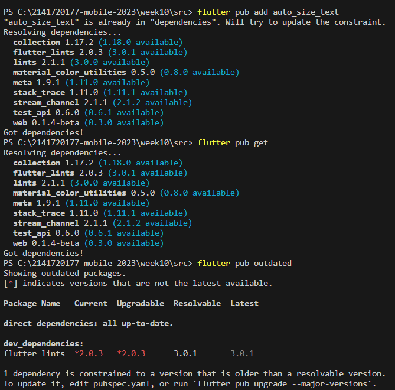

# <B>PRAKTIKUM</B>

    Kenapa error? karena belum dideklarasikannya variable text dan import AutoSizeText

# Pertanyaan Tugas

    2. Plugin auto_size_text digunakan dalam Flutter untuk membuat
       teks dalam widget Flutter secara otomatis menyesuaikan ukuran teksnya sehingga cocok dalam ruang yang tersedia. Ini berguna ketika kita ingin memastikan teks kita selalu terlihat dengan baik tanpa perlu mengatur ukuran teks secara manual.
    3. Jawab:
       a. final String text:
          Variabel ini bertipe String dan diberi kata kunci final, yang berarti nilainya tidak dapat berubah setelah diinisialisasi. Variabel ini digunakan untuk menyimpan teks yang akan ditampilkan oleh widget ini.
       b. required this.text:
          Ini adalah parameter yang wajib (required) dan digunakan untuk menginisialisasi variabel text yang telah dideklarasikan sebelumnya. Ini berarti setiap kali Anda membuat instance dari widget RedTextWidget, Anda harus memberikan nilai untuk parameter ini.
    4. Memiliki perbedaan dalam segi penggunaan Widget
       RedTextWidget ataupun Widget bawaan dari flutter yakni Text. begitu pula pada color dan width
    5. Jawab:
       a. AutoSizeText: MaxLines
          Mereka menyesuaikan ukuran fontnya dengan anggota grup yang memiliki ukuran font efektif terkecil
       b. AutoSizeText: MinFontSize
          Mereka menyesuaikan ukuran fontnya dengan anggota grup yang memiliki ukuran font efektif terkecil.
       c. AutoSizeText: stepGranularity
          stepGranularity menentukan seberapa besar ukuran font dikurangi setiap langkah. Biasanya, nilai ini tidak boleh di bawah 1 untuk performa terbaik.
       d. AutoSizeText: presetFontSizes
          Jika presetFontSizes disetel, minFontSize, maxFontSize, dan stepGranularity akan diabaikan.
       e. AutoSizeText: overflowReplacement
          Jika teks meluap dan tidak sesuai batasnya, widget ini akan ditampilkan. Ini berguna untuk mencegah teks menjadi terlalu kecil untuk dibaca.
       f. AutoSizeText: Rich Text
          Satu-satunya hal yang harus Anda perhatikan adalah cara kerja penghitungan ukuran font: fontSize dalam parameter gaya AutoSizeText (atau fontSize yang diwarisi jika tidak ada yang disetel) digunakan sebagai referensi.
