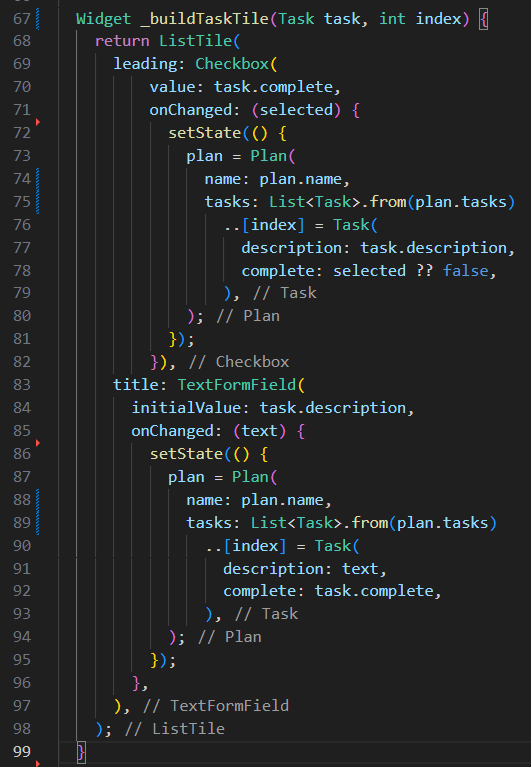
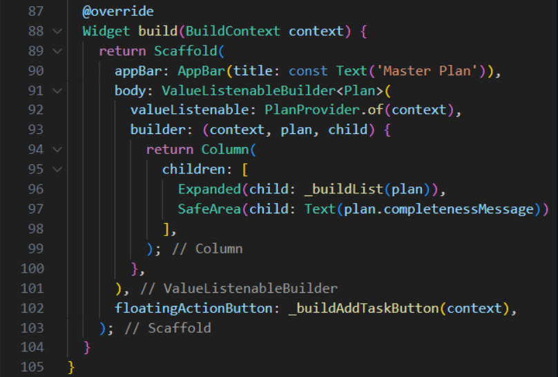
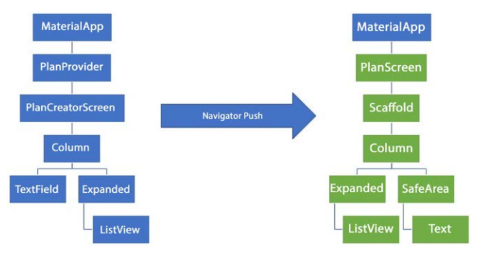
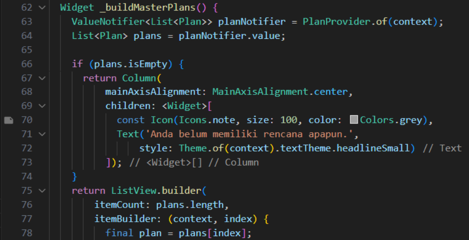
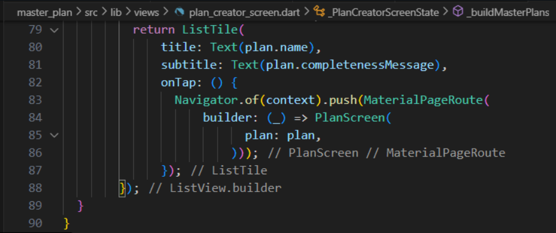

# <b> PRAKTIKUM 1

Tugas Praktikum 1: Dasar State dengan Model-View</b>

1. Selesaikan langkah-langkah praktikum tersebut, lalu dokumentasikan berupa GIF hasil akhir praktikum beserta penjelasannya di file README.md! Jika Anda menemukan ada yang error atau tidak berjalan dengan baik, silakan diperbaiki.

2. Jelaskan maksud dari langkah 4 pada praktikum tersebut! Mengapa dilakukan demikian?

<b>Jawab:</b>

    proses impor akan lebih ringkas seiring berkembangnya aplikasi.

3. Mengapa perlu variabel plan di langkah 6 pada praktikum tersebut? Mengapa dibuat konstanta ?

<b>Jawab:</b>

    Jadi, secara umum, variabel plan diinisialisasi sebagai konstan mungkin karena pada tahap awal pembuatan \_PlanScreenState, kita ingin memiliki objek Plan dengan nilai-nilai default yang konstan dan tidak dapat diubah setelahnya.

4. Lakukan capture hasil dari Langkah 9 berupa GIF, kemudian jelaskan apa yang telah Anda buat!

<b>Jawab:</b>

    Dari langkah 8, kita butuh ListTile untuk menampilkan setiap nilai dari plan.tasks. Kita buat dinamis untuk setiap index data, sehingga membuat view menjadi lebih mudah. Tambahkan kode berikut ini.

5. Apa kegunaan method pada Langkah 11 dan 13 dalam lifecyle state?

<b>Jawab:</b>

    Langkah 11 (initState): Digunakan untuk inisialisasi awal objek atau sumber daya yang dibutuhkan oleh widget. Dalam contoh ini, sebuah ScrollController dibuat dan ditambahkan listener untuk mengelola fokus saat pengguna menggulir.

    Langkah 13 (dispose): Digunakan untuk membersihkan atau melepaskan sumber daya ketika widget dihapus dari tree. Pada contoh ini, dispose dipanggil untuk memastikan ScrollController dibebaskan dengan benar dan mencegah kebocoran memori.

6. Kumpulkan laporan praktikum Anda berupa link commit atau repository GitHub ke spreadsheet yang telah disediakan!

# <b> PRAKTIKUM 2

Tugas Praktikum 2: InheritedWidget</b>

1. Selesaikan langkah-langkah praktikum tersebut, lalu dokumentasikan berupa GIF hasil akhir praktikum beserta penjelasannya di file README.md! Jika Anda menemukan ada yang error atau tidak berjalan dengan baik, silakan diperbaiki sesuai dengan tujuan aplikasi tersebut dibuat.

2. Jelaskan mana yang dimaksud InheritedWidget pada langkah 1 tersebut! Mengapa yang digunakan InheritedNotifier?

<b>Jawab:</b>

    Penggunaan InheritedNotifier dalam PlanProvider pada langkah 1 menunjukkan bahwa langkah 1 ingin menyediakan ValueNotifier<Plan> ke widget anak di subtree, dan pada saat yang sama, mengaktifkan kemampuan mendengarkan perubahan nilai tersebut. Dengan cara ini, ketika nilai dalam ValueNotifier berubah, widget anak yang bergantung pada nilai tersebut akan diberitahu dan dapat merespons perubahan tersebut tanpa perlu meresapi hirarki widget secara manual.

3. Jelaskan maksud dari method di langkah 3 pada praktikum tersebut! Mengapa dilakukan demikian?

<b>Jawab:</b>

    Metode completedCount memberikan fungsionalitas untuk menghitung jumlah tugas yang sudah selesai dengan cara yang bersih dan ringkas. Ini memungkinkan untuk mendapatkan informasi spesifik tentang seberapa banyak tugas yang sudah selesai.

    Metode completenessMessage menggunakan hasil dari completedCount untuk menyusun pesan yang memberikan informasi ringkas tentang kemajuan atau kelengkapan tugas. Ini membuat presentasi data menjadi lebih mudah dimengerti dan dapat digunakan, misalnya, untuk ditampilkan dalam antarmuka pengguna (UI).

4. Lakukan capture hasil dari Langkah 9 berupa GIF, kemudian jelaskan apa yang telah Anda buat!

<b>Jawab:</b>

    tambahkan widget SafeArea dengan berisi completenessMessage pada akhir widget Column. Perhatikan kode berikut ini.

5. Kumpulkan laporan praktikum Anda berupa link commit atau repository GitHub ke spreadsheet yang telah disediakan!

.gif>)

# <b> PRAKTIKUM 2

1. Selesaikan langkah-langkah praktikum tersebut, lalu dokumentasikan berupa GIF hasil akhir praktikum beserta penjelasannya di file README.md! Jika Anda menemukan ada yang error atau tidak berjalan dengan baik, silakan diperbaiki sesuai dengan tujuan aplikasi tersebut dibuat.

2. Berdasarkan Praktikum 3 yang telah Anda lakukan, jelaskan maksud dari gambar diagram berikut ini!

<b>Jawab:</b>

    Perbedaan 2 widget tree diatas adalah pada plannya, yang mana untuk widget tree di sebelah kiri dikhususkan untuk struktur proses pembuatan plan baru. sedangkan untuk widget tree sebelah kanan dikhususkan untuk struktur tampilan utama

3. Lakukan capture hasil dari Langkah 14 berupa GIF, kemudian jelaskan apa yang telah Anda buat!

<b>Jawab:</b>

    _buildMasterPlans adalah sebuah metode yang membangun UI untuk menampilkan daftar rencana. Jika daftar rencana kosong, pesan informasional ditampilkan; jika tidak, daftar rencana ditampilkan dalam bentuk ListView yang dapat di-scroll.

4. Kumpulkan laporan praktikum Anda berupa link commit atau repository GitHub ke spreadsheet yang telah disediakan!

.gif>)
