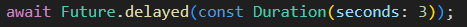
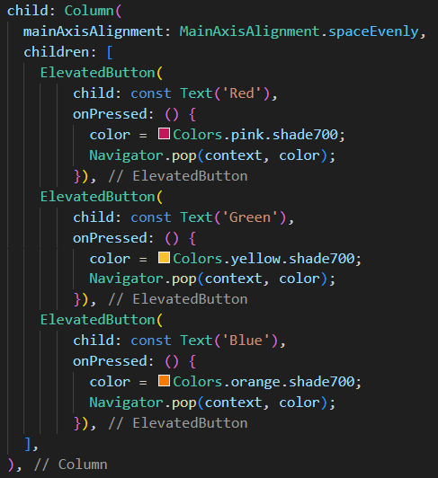
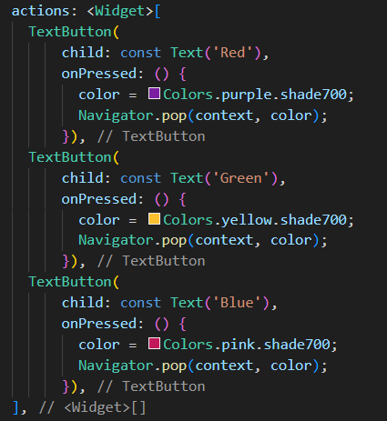

# <b> 1. Praktikum 1: Mengunduh Data dari Web Service (API) </b>

<b>Jawab:</b>

        substring: Ini adalah metode yang digunakan untuk mengambil sebagian dari string (urutan karakter) dari suatu string yang lebih besar.

        catchError: Ini adalah bagian dari konsep error handling di Dart, digunakan untuk menangkap dan menangani kesalahan yang mungkin terjadi selama eksekusi program.

        Kedua konsep ini membantu dalam pengelolaan string dan penanganan kesalahan untuk memastikan bahwa aplikasi berperilaku dengan benar dan dapat memberikan informasi yang berguna kepada pengguna jika terjadi kesalahan.

.gif>)

# <b> 2. Praktikum 2: Menggunakan await/async untuk menghindari callbacks </b>

<b>Jawab:</b>

        pada langkah 1, kode tersebut mendefinisikan tiga fungsi asynchronous (fungsi yang mengembalikan Future). Setiap fungsi ini memiliki pola yang sama: menunggu (await) selama 3 detik menggunakan Future.delayed dan kemudian mengembalikan angka tertentu.

        pada langkah 2, Kode tersebut mendefinisikan fungsi count yang merupakan fungsi asynchronous (async). Fungsi ini menggunakan tiga fungsi asynchronous sebelumnya (returnOneAsync, returnTwoAsync, dan returnThreeAsync) untuk menghitung total dan kemudian mengupdate result dalam setState.

.gif>)

# <b> 3. Praktikum 3: Menggunakan Completer di Future </b>

<b>Jawab:</b>

        Intinya, kode tersebut menggunakan Completer untuk menciptakan dan mengelola objek Future.

        Dengan penggunaan Completer, getNumber memberikan cara asinkron untuk mendapatkan suatu nilai setelah operasi yang memakan waktu selesai. Completer memberikan cara untuk menangani dan menyelesaikan suatu Future ketika operasi asynchronous selesai dilakukan.

<b>Jawab:</b>

        Perbedaan antara dua set kode tersebut adalah penggunaan penanganan kesalahan (error handling) dan penggunaan blok try-catch.

.gif>)

# <b> 4. Praktikum 4: Memanggil Future secara paralel </b>

<b>Jawab:</b>

        Langkah 1 menggunakan FutureGroup, yang memungkinkan penambahan dinamis operasi Future dan menangani hasilnya ketika semuanya selesai.
        Langkah 4 menggunakan Future.wait, yang cocok ketika Anda memiliki daftar operasi Future yang tetap dan ingin menunggu sampai semuanya selesai.

.gif>)

# <b> 5. Praktikum 5: Menangani Respon Error pada Async Code </b>

<b>Jawab:</b>

        returnError Function:

        1. Menjalankan operasi asinkron yang mengalami kesalahan (error).
        2. Fungsi ini menunda eksekusi selama 2 detik dan kemudian melemparkan exception.

        handleError Function:

        1. Menangani (handle) kesalahan yang mungkin terjadi saat menjalankan operasi asinkron (seperti yang dilakukan oleh returnError).
        2. Jika ada kesalahan, mengatur variabel result ke pesan kesalahan tersebut. Jika tidak, mengatur result ke 'Success'.
        3. Mencetak 'Completed' ke konsol, terlepas dari apakah operasi selesai dengan sukses atau kesalahan.

        Jadi, returnError membuat dan melempar kesalahan, sedangkan handleError menangani kesalahan tersebut dan mengelolanya, serta mengatur variabel result dan mencetak sesuatu ke konsol.

.gif>)

.gif>)

# <b> 6. Praktikum 6: Menggunakan Future dengan StatefulWidget </b>

<b>Jawab:</b>

        Kode yang disediakan merupakan aplikasi Flutter yang menggunakan paket geolocator untuk mendapatkan lokasi saat ini (latitude dan longitude) perangkat dan menampilkannya di layar. Fungsi getLocation dipanggil dalam metode initState untuk mendapatkan lokasi ketika widget diinisialisasi.

.gif>)

# <b> 7. Praktikum 7: Manajemen Future dengan FutureBuilder </b>

<b>Jawab:</b>

        Pada praktikum sebelumnya, pembaruan antarmuka pengguna (UI) dilakukan dengan menggunakan metode setState setelah mendapatkan posisi. Namun, pada praktikum terbaru, cara yang digunakan untuk memperbarui UI adalah dengan menggunakan FutureBuilder. FutureBuilder secara otomatis mengelola pembaruan UI berdasarkan status future yang terkait.

<b>Jawab:</b>

        Terdapat perbedaan pada UI dengan arah yang semakin positif seperti lebih clean, dan lainnya.

.gif>)

.gif>)

# <b> 8. Praktikum 8: Navigation route dengan Future Function</b>

<b>Jawab:</b>

        Terdapat perubahan warna tiap button yang di klik, menunjukkan fungsi yang diterapkan pada program berhasil diterapkan yaitu perubahan warna background seusai button yang pengguna klik.

.gif>)

# <b> Praktikum 9: Memanfaatkan async/await dengan Widget Dialog</b>

<b>Jawab:</b>

        Terdapat perubahan warna tiap pilihan yang di klik, menunjukkan fungsi yang diterapkan pada program berhasil diterapkan yaitu perubahan warna background seusai pilihan yang pengguna klik.

.gif>)
