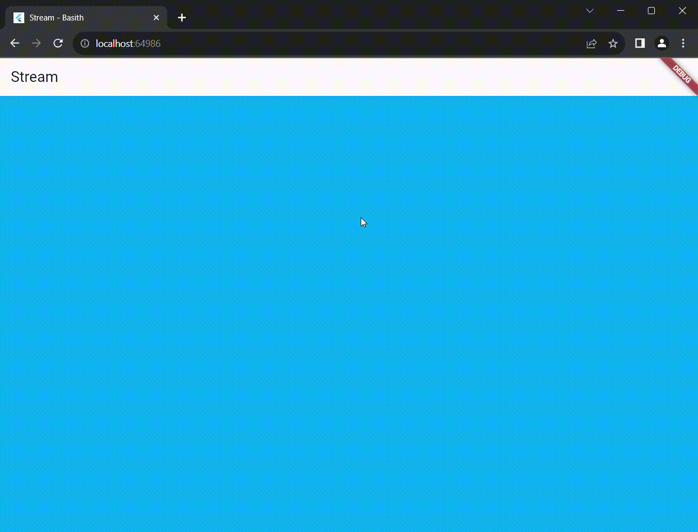
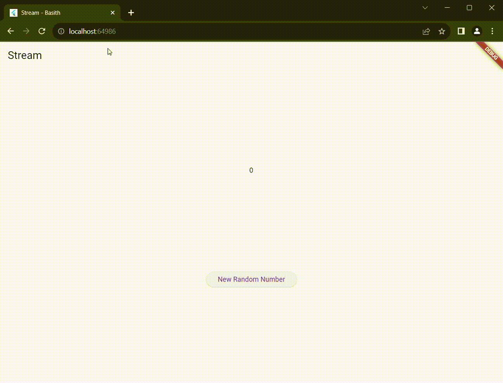
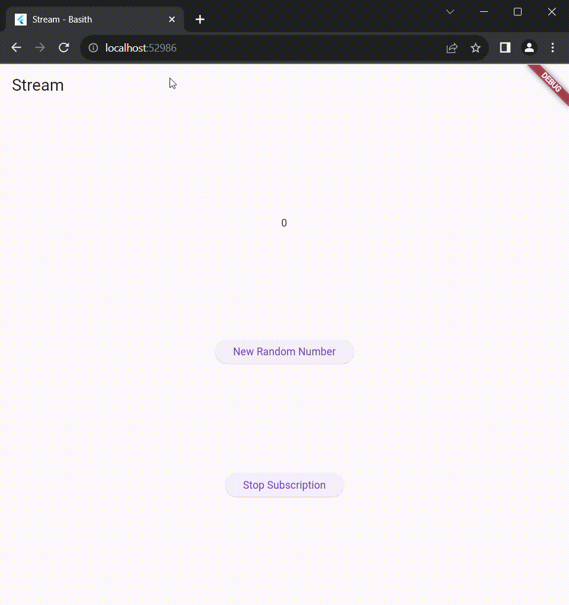
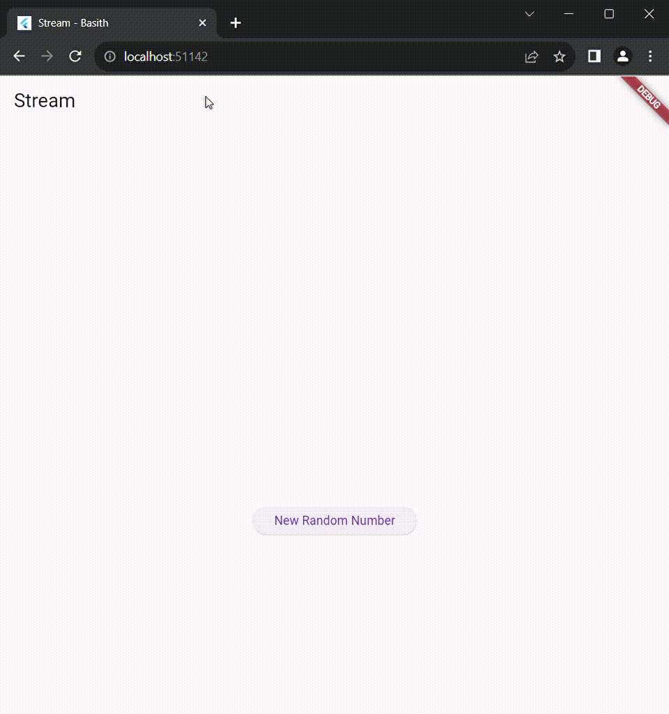
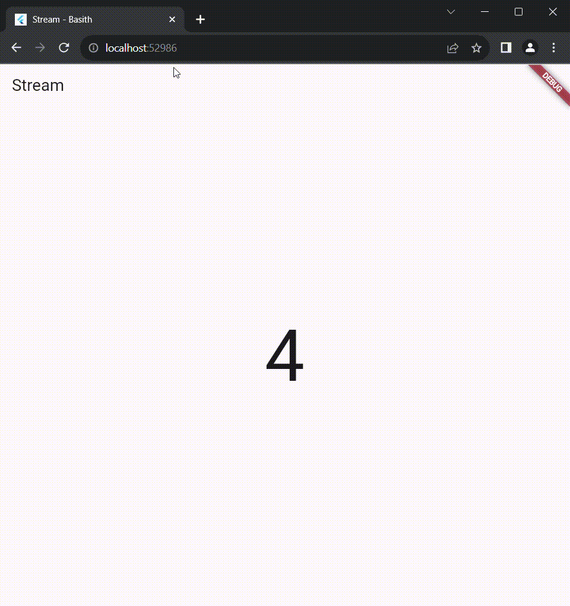
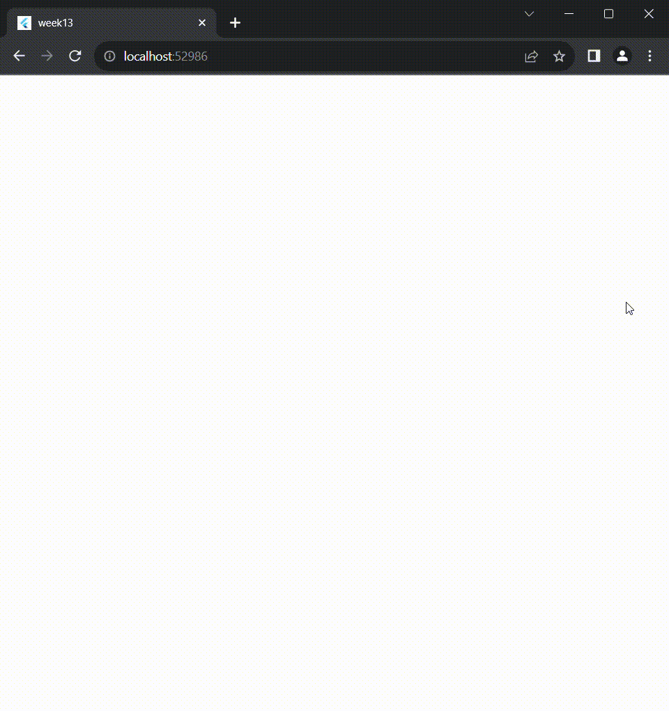

# <b>PRAKTIKUM 1:

    listen: Digunakan untuk membuat langganan pada stream dan menjalankan callback setiap kali ada peristiwa. Dapat dipanggil banyak kali untuk satu langganan.

    await for: Menggunakan struktur loop untuk menunggu peristiwa berikutnya dari stream secara asinkron. Hanya dapat digunakan di dalam fungsi yang diberi kata kunci async. Cocok untuk penanganan asinkron yang bersih dan sederhana.

# <b>PRAKTIKUM 2:

    program pertama menyiapkan struktur aliran dan menghubungkannya dengan antarmuka pengguna (UI), sedangkan program kedua bertanggung jawab untuk menghasilkan dan menyuntikkan angka acak ke dalam aliran tersebut. Keduanya bekerja sama untuk menciptakan aplikasi yang dinamis dengan data yang diperbarui secara dinamis.

    program ini menunjukkan bagaimana mengelola dan memberi tahu kesalahan dalam aliran (stream) menggunakan Dart Stream API, serta bagaimana mengatasi kesalahan tersebut dalam UI dengan bantuan setState

.gif>)

# <b>PRAKTIKUM 3:

    Kode tersebut menggunakan StreamTransformer untuk mengubah data dalam suatu stream. Dalam inisialisasi, objek transformer dibuat untuk mengalikan nilai data dalam stream dengan 10 dan menangani kesalahan dengan mengirimkan nilai -1. Selanjutnya, stream tersebut diubah dengan transformer, dan setiap kali data baru masuk, nilai lastNumber diperbarui sesuai dengan hasil transformasi. Jika terjadi kesalahan dalam stream, nilai lastNumber diatur menjadi -1. Penggunaan setState memastikan perubahan nilai direfleksikan dalam antarmuka pengguna, memungkinkan respons visual yang dinamis terhadap perubahan dalam stream.

# <b>PRAKTIKUM 4:

    Program Pertama (initState): Membuat dan mengelola stream (NumberStream), membuat langganan (subscription) ke stream, dan mengupdate tampilan setiap kali ada peristiwa di stream.

    Program Kedua (subscription.cancel()): Membatalkan langganan ke stream, menghentikan pembaruan tampilan dari peristiwa selanjutnya.

    Program Ketiga (addRandomNumber): Menghasilkan angka acak, mengatur ulang tampilan, dan menyimpan angka terakhir untuk ditampilkan.

# <b>PRAKTIKUM 5:

    a. Aplikasi ini memanfaatkan stream untuk mengelola perubahan angka dan warna secara asinkron.
    b. NumberStream bertanggung jawab untuk menghasilkan angka acak melalui stream.
    c. ColorStream menyediakan stream warna yang berubah setiap detik.
    d. State dari StreamHomePage (_StreamHomePageState) memantau perubahan di kedua stream tersebut.
    e. Pada setiap perubahan, antarmuka pengguna diperbarui secara otomatis.

# <b>PRAKTIKUM 6:

    Program pertama adalah sebuah kelas bernama NumberStream yang memiliki metode bernama getNumbers(). Metode ini mengembalikan stream berupa deretan angka yang dihasilkan secara acak setiap detik menggunakan Stream.periodic.

    Program kedua adalah widget Flutter yang menggunakan stream yang dihasilkan oleh NumberStream untuk memperbarui antarmuka pengguna. Widget ini menggunakan StreamBuilder untuk secara otomatis membangun ulang antarmuka setiap kali terjadi perubahan pada stream.

# <b>PRAKTIKUM 7:

    a. bloc_random_basith.dart: Berisi implementasi RandomNumberBloc yang menggunakan StreamController untuk mengelola logika bisnis terkait dengan angka acak.

    b. random_screen.dart: Merupakan widget yang menggunakan RandomNumberBloc untuk menampilkan angka acak pada antarmuka pengguna. Menggunakan StreamBuilder untuk memperbarui antarmuka pengguna saat terjadi perubahan pada stream angka acak.

    c. main.dart: Memulai aplikasi Flutter dan menetapkan RandomScreen sebagai halaman utama.

